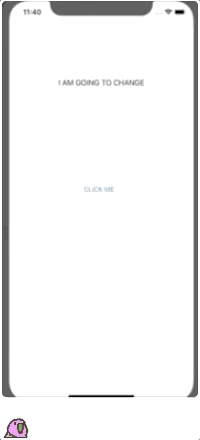

# hello-cross-plattform-mobile

Testing out Hello World in Rust/Go/Kotlin Native



## Tools

**Android Studio**

Compile SDK version: 29<br>
Emulator version: Android 8.0<br>
NDK: 20.0.5594570 CMAKE: latest per 13.08.19 LLDB: latest per 13.08.19

**Xcode**

Xcode: 10.3 Build version: 10G8

**Go**

Version: 1.12.7 Gomobile version: +597adff

**Rust**

Version: 1.36.0 Rustup cargos: -lipo (cargo for generating universal ios libs) cbindgen

**Kotlin**

Version: 1.3.41

**Paths**

`PATH=$PATH:~/.cargo/bin`
`PATH=$PATH:~/go/bin`
`ANDROID_HOME=/Users/$USER/Library/Android/sdk`
`NDK_HOME=$ANDROID_HOME/ndk-bundle`

## General notes

Being new to mobile development i encountered a lot of problems with importing the libraries, mainly pathing and naming issues. Some , if not all, of the languages had had very specific specific approaches to creating native libraries, which are detailed in various tutorials:

[Go IOS/Android](https://github.com/golang/go/wiki/Mobile#sdk-applications-and-generating-bindings)\
[Rust IOS](https://mozilla.github.io/firefox-browser-architecture/experiments/2017-09-06-rust-on-ios.html)\
[Rust Android](https://mozilla.github.io/firefox-browser-architecture/experiments/2017-09-21-rust-on-android.html)\
[Kotlin IOS/Android](https://kotlinlang.org/docs/tutorials/native/mpp-ios-android.html#creating-the-shared-module)

## Notes for Go

The command below installs the gomobile package needed for generating native libraries.

```
go get golang.org/x/mobile/cmd/gomobile
```

The command below cleans the gomobile cache(useful between building bindings):

```
gomobile clean
```

Remember to use a capital letter in your function names this tells the compiler that you are exporting the function.

```
func Hello() string{
  return "Return me"
}
```

Check the [godoc](https://godoc.org/golang.org/x/mobile/cmd/gobind) for type restrictions.

> Gomobile doesn't support Bitcode right now, so we will take this advice and go and disable it. So you must disable Bitcode for any application that imports a Gomobile framework. Currently some types (like slices) are not supported by Gomobile, so you'll have to wrap things in structs and methods. This is a pain, because your Go code ends up looking very non-Go, and if you have other customers for your code, you might end up with a pretty ugly and hard to use package.

### Xcode

The command below creates a framework in your current directory from your `$goproject` located in your $GOPATH. It is highly recommended to bind the framework directly into your Xcode project.

```
gomobile bind -target=ios $goproject
```

> Be careful with names; they might have to be slightly more verbose (PrintSomething vs Print) than we would like in traditional Go code so it doesn't clash in Swift. Your package name must match the name of your framework. So package greeter means our framework must be called Greeter.framework.

### Android Studio

The command below creates $goproject.aar in your current directory from your `$goproject` located in your `$GOPATH`.

```
gomobile bind -target=android -o $goproject.aar $goproject
```

Import the binding by placing the output from the command above into your libs folder of your android application. Update your build.graddle(module) with `implementation (name: 'hello', ext: 'aar')` and your build.graddle(project) `flatDir{ dirs 'libs' }`.

>The log package does not work with Android.\
>Android on MIPS devices is not yet supported.

### Notes for Rust

The commands below adds the architectures needed for building binaries to IOS and Android.
```
rustup target add aarch64-apple-ios armv7-apple-ios armv7s-apple-ios x86_64-apple-ios i386-apple-ios
rustup target add aarch64-linux-android armv7-linux-androideabi i686-linux-android
```
The command below creates a basic rust library. With a `Cargo.toml` file, that defines the metadata of your project and a `src/lib.rs` file which will contain the rust code for the library.
```
cargo new $lib_name --lib
```

> Because rust, much like C or C++, manages its own memory we must do manual memory management when passing objects between Swift/Java/Kotlin and Rust.\
The rust lib HTTP is no longer being worked on, but hyper and reqwest(built on top of hyper) both have activity on their github respositories.

#### Xcode

The commands below adds lipo, a package for building universal IOS binaries and cbindgen a package for generating C headers.
```
cargo install cargo-lipo
cargo install cbindgen
```

Example of method in lib.rs:
```
# [no_mangle]

pub extern fn helloworld() -> *mut c_char { CString::new("Hello world from Rust".to_owned()).unwrap().into_raw() }
```
>Because we are interfacing with swift we have to make use of C calling conventions, this means we have to tell rust not to mangle any names (with #[no_mangle]), we also have to convert between rust strings and C strings.

Create C header with cbindgen in your `$lib_name` directory:
```
cbindgen src/lib.rs -l c > $libraryName.h
```

Edit Cargo.toml:
```
[lib] name = "$libraryName" crate-type = ["statcilib", "cdylib"]
```

Build Rust library from your `$lib_name directory`, this will generate a library to `$lib_name/universal/release`:
```
cargo lipo --release
```
Copy Rust binary and header file into Xcode:

1. Create two directories in your $Xcode_project directory, libs and include.
2. Copy header generated from cbindgen to `$Xcode_project/include` and the lib to `$Xcode_project/libs`.
3. Create the Objective-C Bridging Header `$lib_name-Bridging-Header.h`, or mov in the $Xcode_project dir:
```
#ifndef Hello_Bridging_Header_h
#define Hello_Bridging_Header_h
#import "hello.h"
#endif
```
4. Add the library to "Linked Frameworks and Libraries" in Xcode. Update the library path `$Xcode_project/libs` to "Library Search Paths". Update the header path `$Xcode_project/include` to "Header Search Paths". Update the path `$Xcode_project/$lib_name-Bridging-Header.h` to "Objective-C Bridging Header".
5. (Optional) Create a new swift class to use ur library, this way you don't have to deal with memory management.

```
class RustHello {
    func sayHello(to: String) -> String {
        let result = helloworld(to)
        let swift_result = String(cString: result!)
        hellofree(UnsafeMutablePointer(mutating: result))
        return swift_result
    }
}
```

#### Android Studio

Set up standalone toolchains for Rust:
```
mkdir ~/.NDK

$ANDROID_HOME/ndk-bundle/build/tools/make_standalone_toolchain.py --api 26 --arch arm64 --install-dir ~/.NDK/arm64; $ANDROID_HOME/ndk-bundle/build/tools/make_standalone_toolchain.py --api 26 --arch arm --install-dir ~/.NDK/arm; $ANDROID_HOME/ndk-bundle/build/tools/make_standalone_toolchain.py --api 26 --arch x86 --install-dir ~/.NDK/x86;
```

>This only needs to be done once for your system .

The cargo config file needs to be aware of these paths. Append the file `~/.cargo/config`, create it if it doesn't exist.
```
[target.aarch64-linux-android] ar = ".NDK/arm64/bin/aarch64-linux-android-ar" linker = ".NDK/arm64/bin/aarch64-linux-android-clang"

[target.armv7-linux-androideabi] ar = ".NDK/arm/bin/arm-linux-androideabi-ar" linker = ".NDK/arm/bin/arm-linux-androideabi-clang"

[target.i686-linux-android] ar = ".NDK/x86/bin/i686-linux-android-ar" linker = ".NDK/x86/bin/i686-linux-android-clang"
```

Example of method in lib.rs:
```
# [cfg(target_os="android")]
# [allow(non_snake_case)]

pub mod android { extern crate jni;

use super::*;
use self::jni::JNIEnv;
use self::jni::objects::{JClass, JString};
use self::jni::sys::{jstring};

#[no_mangle]
pub unsafe extern fn Java_com_example_helloworld_RustHello_hello(env: JNIEnv, _: JClass, java_pattern: JString) -> jstring {
    // Our Java companion code might pass-in "world" as a string, hence the name.
    let world = helloworld(env.get_string(java_pattern).expect("invalid pattern string").as_ptr());
    // Retake pointer so that we can use it below and allow memory to be freed when it goes out of scope.
    let world_ptr = CString::from_raw(world);
    let output = env.new_string(world_ptr.to_str().unwrap()).expect("Couldn't create java string!");

    output.into_inner()
}
```
>```#![cfg(target_os="android")]```Tells the compiler to target Android based on flag passed to the compiler.\
> ```#[allow(non_snake_case)]```JNI requiers CamelCase which are not standard in Rust.\
> ```Java_com_example_helloworld_RustHello_hello```The way that JNI constructs the name of the function that it will call is. Java_domain_class_methodname

Update Cargo.toml with jni lib and crate-type:
```
[dependencies] jni = { version = "0.10.2", default-features = false }

[profile.release] lto = true

[lib] name = "$libraryName" crate-type = ["cdylib"]
```

Build lib for supported targets:
```
cargo build --target aarch64-linux-android --release
cargo build --target armv7-linux-androideabi --release
cargo build --target i686-linux-android --release
```

Copy native libs into your Android Project:
```
mkdir android/app/src/main/jniLibs
mkdir android/app/src/main/jniLibs/arm64-v8a
mkdir android/app/src/main/jniLibs/armeabi-v7a
mkdir android/app/src/main/jniLibs/x86

cp $project_name/target/aarch64-linux-android/release/librust.so android/app/src/main/jniLibs/arm64-v8a/librust.so
cp $project_name/target/armv7-linux-androideabi/release/librust.so android/app/src/main/jniLibs/armeabi-v7a/librust.so
cp $project_name/target/i686-linux-android/release/librust.so android/app/src/main/jniLibs/x86/librust.so
```


### Notes for Kotlin

Kotlin can build libraries for both IOS and Android using gradle, either in Android Studio or console.
>Common module can only contain Kotlin code and cannot depend on any JVM libs such as Retrofit, Moshi or RXJava
>Currently Kotlin/Native does not support communication between threads using coroutine primitives. Kotlin Native also provides the Worker abstraction.

Create directory and a build.gradle.kts file for your library:
```
mkdir $Mylib touch $Mylib/build.gradle.kts
```
In this project i created an Android Studio project in the same directory as i created my $Mylib directory.
This made it really easy to import $Mylib into Android Studio both using it and creating a framework for IOS.

Import $Mylib into your settings.gradle file in your Android Studio project:
```
include: '$Mylib'
```

Edit the build.gradle.kts file:
```
import org.jetbrains.kotlin.gradle.plugin.mpp.KotlinNativeTarget

plugins { kotlin("multiplatform") }

kotlin { //select iOS target platform depending on the Xcode environment variables
  val iOSTarget: (String, KotlinNativeTarget.() -> Unit) -> KotlinNativeTarget =
    if (System.getenv("SDK_NAME")?.startsWith("iphoneos") == true)
      ::iosArm64
    else
        ::iosX64

  iOSTarget("ios") {
      binaries {
          framework {
              baseName = "$Mylib"
          }
      }
  }

  jvm("android")

  sourceSets["commonMain"].dependencies {
      implementation("org.jetbrains.kotlin:kotlin-stdlib-common")
  }

  sourceSets["androidMain"].dependencies {
      implementation("org.jetbrains.kotlin:kotlin-stdlib")
}

val packForXcode by tasks.creating(Sync::class) {
    val targetDir = File(buildDir, "xcode-frameworks")

    /// selecting the right configuration for the iOS
    /// framework depending on the environment
    /// variables set by Xcode build
    val mode = System.getenv("CONFIGURATION") ?: "DEBUG"
    val framework = kotlin.targets
                          .getByName<KotlinNativeTarget>("ios")
                          .binaries.getFramework(mode)
    inputs.property("mode", mode)
    dependsOn(framework.linkTask)

    from({ framework.outputDirectory })
    into(targetDir)

    /// generate a helpful ./gradlew wrapper with embedded Java path
    doLast {
        val gradlew = File(targetDir, "gradlew")
        gradlew.writeText("#!/bin/bash\n"
            + "export 'JAVA_HOME=${System.getProperty("java.home")}'\n"
            + "cd '${rootProject.rootDir}'\n"
            + "./gradlew \$@\n")
        gradlew.setExecutable(true)
    }
}

tasks.getByName("build").dependsOn(packForXcode)
```

Example method in Kotlin:
```
package com.jetbrains.handson.mpp.mobile

fun $kotlinMethodName() : String {
  return "Hello World from Kotlin"
}
```

One of the resources used to create this project recommended to have the following file structure:
```
$Mylib/src/commonMain/kotlin/common.kt
```
>Contains the general code for your lib.

```
$Mylib/src/androidMain/kotlin/actual.kt
```
>Contains the Android specific code for your lib.
```
$Mylib/src/iosMain/kotlin/actual.kt
```
>Contains the IOS specific code for your lib.
#### Xcode

Build the framework either in the Android Studio gradle tab or in your console with:
```
./gradlew :$Mylib:packForXcode
```

Import the framework to Xcode and set the "Framework Search Paths" in the build settings to:
```
$Mylib/build/xcode-frameworks
```

Add a new "Run Script" to Xcode so that the Gradle build prepares $Mylib before each run:
```
cd "$SRCROOT/../../SharedCode/build/xcode-frameworks" ./gradlew :SharedCode:packForXCode -PXCODE_CONFIGURATION=${CONFIGURATION}
```

Swift method-calling example:
```
label.text = CommonKt.$kotlinMethodName()
```

#### Android Studio

Edit the app/build.graddle:
```
implementation project(':$Mylib')
```

Import the library to your Activity:
```
import com.jetbrains.handson.mpp.mobile.$kotlinMethodName
```
Kotlin method-calling example:
```
import import com.jetbrains.handson.mpp.mobile.$kotlinMethodName

val test = $kotlinMethodName()
```
